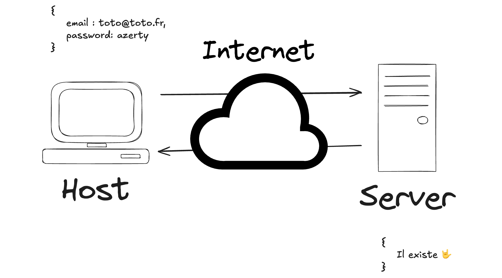
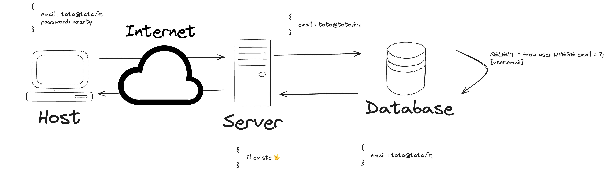
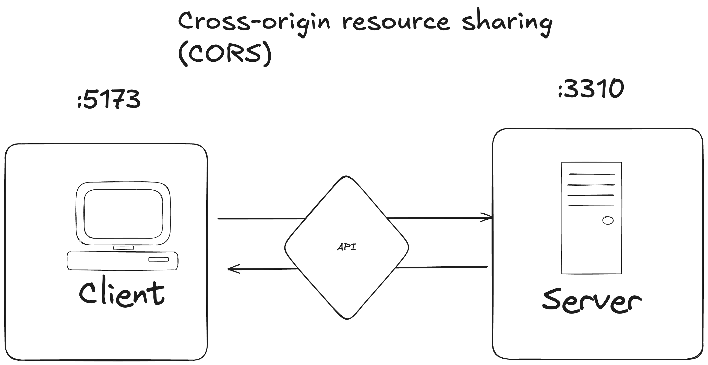

# Création d'un workshop pour l'authentification

## Sommaire

-   Step1: [Creaction d'un backend](#step-1-creation-dun-backend)
-   Step2: [Creation d'un frontend](#step-2-creation-dun-frontend)

## Step 1: Creation d'un backend

-   [x] Créer un dossier `server` à la racine du projet et se rendre dedans.
-   [x] Ajout d'un fichier index.ts pour le serveur.
-   [x] Création d'un `package.json`.
-   [x] Installation des dépendances
-   [x] Création d'un serveur express

```shell
npm install express
npm install @types/express
npm install typescript ts-node
```

-   [x] Initialiser un fichier de configuration TS.

```shell
npx tsc --init
```

-   [x] Ajouter un script pour démarrer le serveur.

```json
"start": "ts-node index.ts"
```

-   [x] Ne pas oublier de faire un `git init` (et un .gitignore) pour initialiser le projet.
-   [x] Creation de mon serveur express. [Express - Node.js web application framework](https://expressjs.com/)
-   [x] Nous allons devoir compiler notre code, j'ajoute donc quelques package pour que celui ci fonctionne correctement.

```shell
npm install @types/node
npm install ts-node-dev --save-dev
```

---

### Login

-   [x] Nous avons besoin d'un middleware d'express pour lire les information de `req.body`. J'utilise le middleware `express.json()`.

Nous avons jusqu'a présent fait ce cycle là:



Et notre but, c'est de faire ça :



Nous allons donc installer un module npmjs pour configurer notre bdd et ainsi pouvoir faire des requêtes sur celle ci.

-   [x] Le package que nous avons installé est `mysql2` et nous avons créé un fichier de configuration expres pour lui.
    -   Nous avons créé une db

```sql
create table user(id int auto_increment not null primary key, email varchar(50) not null, password varchar(50) not null);
```

-   [x] Nous avons ajouté un utilisateur

```sql
insert into user(email, password) values('toto@lafrite.fr', '1234');
```

-   [x] Nous avons ajouté un endpoint pour le login
-   [x] On a importé notre fichier de configuration de la db
-   [x] On a fait notre logique de recherche utilisateur dans notre fichier `index.ts`

#### Vérification du mot de passe

-   [x] Nous avons installé le package `argon2` pour vérifier le mot de passe de l'utilisateur.
-   [x] Nous avons ajouté un middleware pour vérifier le mot de passe avant de renvoyer l'user.
    -   Toutes les informations sont dans le fichier [hashPwd.ts](./server/middlewares/hashPwd.ts)

### Register

-   [x] Nous avons ajouté un endpoint pour le register
-   [x] Sur le même principe que le `login`, nous avons ajouter un utilisateur dans notre db.
-   [x] Nous allons devoir hasher le mot de passe de l'utilisateur avant de l'ajouter dans la db.
-   [ ] Nous devons créer un token pour l'utilisateur qui vient de se loguer.

#### Hash du mot de passe

-   [x] Nous avons installé le package `argon2` pour hasher le mot de passe de l'utilisateur.
-   [x] Nous avons ajouté un middleware pour hasher le mot de passe avant de l'ajouter dans la db.
    -   Toutes les informations sont dans le fichier [hashPwd.ts](./server/middlewares/hashPwd.ts)

### Types

Attention, dans notre middleware, nous ajoutons une clé `user` dans notre objet `req`. Pour éviter les erreurs, nous allons surcharger le type de notre objet `req`.

-   [x] Nous avons surchargé le type de notre objet `req`.
    -   Toutes les informations sont dans le fichier [index.d.ts](./server/types/index.d.ts)

### Token

-   [x] Nous avons installé le package `jsonwebtoken` pour créer un token pour l'utilisateur. [jsonwebtoken](https://www.npmjs.com/package/jsonwebtoken)
-   [x] Nous avons ajouté un middleware pour créer un token pour l'utilisateur.
    -   Toutes les informations sont dans le fichier [jwtMiddleware.ts](./server/middlewares/jwtMiddleware.ts)
-   [x] Nous avons ajouté un middleware pour vérifier le token de l'utilisateur.
    -   Toutes les informations sont dans le fichier [jwtMiddleware.ts](./server/middlewares/jwtMiddleware.ts)

## Step 2: Creation d'un frontend

-   [x] Créer un dossier `client` à la racine du projet et se rendre dedans.
-   [x] Initialiser un projet React avec [Vite](https://vitejs.dev/).
-   [x] Ajouter un fichier de configuration pour Vite.
-   [x] Création d'un formulaire de login.
    -   Le fichier est dans le dossier [pages](./client/src/pages/Login.tsx)
-   [x] Création d'un formulaire de register.
    -   Le fichier est dans le dossier [pages](./client/src/pages/Register.tsx)
-   [x] Création d'une page pour check mon user connecté.

### Les CORS

-   [x] Nous avons installé le package `cors` pour gérer les [CORS](https://www.npmjs.com/package/cors) de notre application express.
-   [x] Nous avons ajouté un middleware pour gérer les CORS de notre application. - Toutes les informations sont dans le fichier [index.ts](./server/src/index.ts)
        

Dans le cas de figure ci-dessus, nous avons le port `:5173` et le port `:3310`, ça ne plait pas.. Nous partageons donc les ressources entre les deux ports.

Merci à [MDN](https://developer.mozilla.org/fr/docs/Web/HTTP/CORS) pour les informations. ❤️

### Les cookies (coté serveur)

-   [x] Nous pouvons envoyer directement des cookies avec notre réponse.

```ts
res.cookie("token", token, { httpOnly: true });
```

Cependant, nous devons ajouter un package pour gérer les cookies de notre application express, pour qu'il puisse les lire.

-   [x] Nous avons installé le package `cookie-parser` pour gérer les [cookies](https://www.npmjs.com/package/cookie-parser) de notre application express.
-   [x] Nous avons ajouté un middleware pour gérer les cookies de notre application.

```ts
app.use(cookieParser());
```

Et sur notre route `app.get("/check")` nous utiliser le cookieParser pour lire le cookie `token`.

Une fois le tout installé, il faut voir notre middleware `cors` pour qu'il accepte les cookies.

```diff
app.use(
    cors({
        origin: "http://localhost:3000",
+        credentials: true,
    })
);
```

### Les cookies (coté client)

Pour pouvoir recevoir et envoyer des cookies, il faut que notre application React soit configurée pour les accepter.

-   [x] Nous avons installé le package `axios` pour faire des requêtes HTTP.
-   [x] Nous allons sur chacune de nos requêtes, ajouter un header pour accepter les cookies.

```diff
axios.get("http://localhost:3310/check",
+{
+	withCredentials: true,
+}
);
```

### Déconnexion

-   [ ] Nous avons ajouté un bouton pour se déconnecter.
-   [ ] Nous avons ajouté un endpoint pour se déconnecter.
-   [ ] Nous avons ajouté un middleware pour supprimer le cookie de l'utilisateur.

```ts
res.clearCookie("token");
```
